# MVT基本流程

MVT（model-view-templates）核心思想 解耦。
M主要负责数据处理，内嵌ORM框架，操作MySQL数据库。
V接收HttpRequest,业务处理，返回HttpResponse。
T负责封装构造要返回的html，内嵌了模板引擎（前端）。


####安装应用
settings.py中
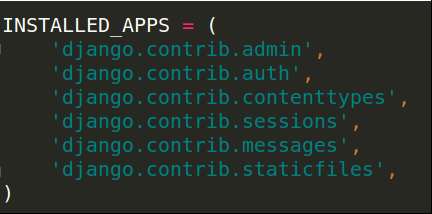
添加要使用的应用
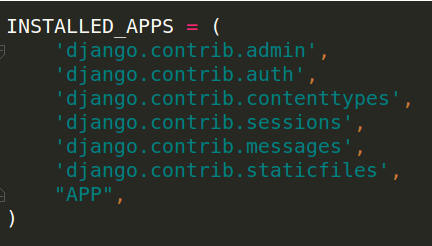

####建立表格

- **在APP的models.py中定义模型类**
例：
``` python
from django.db import models

# Create your models here.

# 自定义类继承models.Model类
class HomeInfo (models.Model):
    """定义家庭信息类"""
    # 定义类属性 
    # id可不用定义 django有自己的方法管理id
    # CharField(max_length=n) 表示最大为n的字符串
    name = models.CharField(max_length=10)
    
    # __str__方法用在后面的站点表示上
    def __str__(self):
        return self.name

class MemberInfo(models.Model):
    """定义家庭成员信息类"""
    name = models.CharField(max_length=10)
    # BooleanField() 表示布尔类型
    gender = models.BooleanField()
    # ForeignKey(类名)表示作为指定类名的外键
    home = models.ForeignKey(HomeInfo)
    
    def __str__(self):
        return self.name
```
- **模型迁移（建表）**
生产迁移文件 python manage.py makemigrations
执行迁移 python manage.py migrate
新增文件0001_initial.py
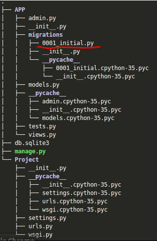

**默认采用sqlite3数据库来存储数据**

####站点管理
Django能够根据定义的模型类自动地生成管理模块
- **管理界面本地化（汉化/修改时区）**

在settings.py中
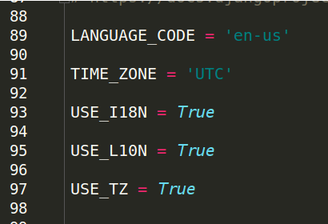

修改为
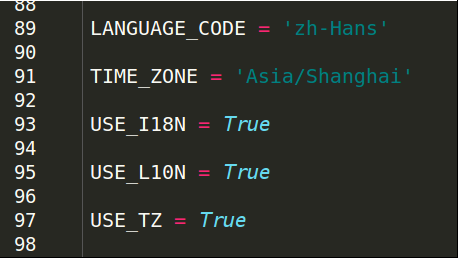

- **创建管理员**
```
python manage.py createsuperuser
```
根据提示输入信息
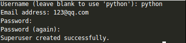

- **注册模型类/自定义站点管理页面**

在admin.py文件中注册模型类
例
``` python
from django.contrib import admin
# 导入模型类所在的模块 以调用类
from APP.models import HomeInfo, MemberInfo

# Register your models here.

# 自定义类继承ModelAdmin父类
class MemberAdmin(admin.ModelAdmin):
    """自定义站点管理界面类"""
    # 固定写法
    list_display = ["id", "name", "gender", "home_id"]

# 注册家庭模型
admin.site.register(HomeInfo)
# 注册家庭成员模型及自定义站点管理模型
admin.site.register(MemberInfo, MemberAdmin)
```

- **发布内容到数据库**
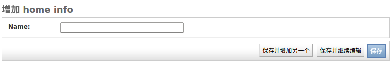
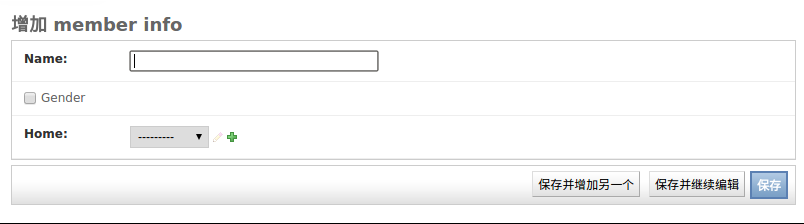
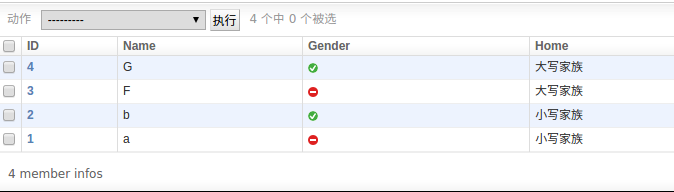


####封装模板
在项目文件下新建一个templates文件，用于存放封装构造好的模板（前端模板）
例
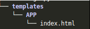

设置templates的路径 使其满足django封装的路径写法
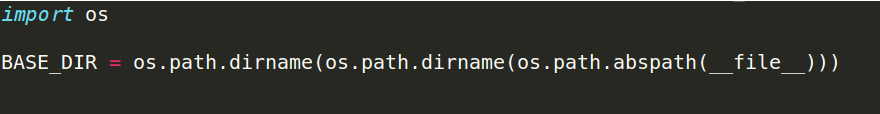
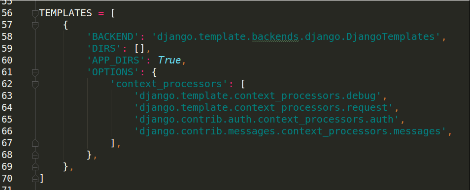
修改为
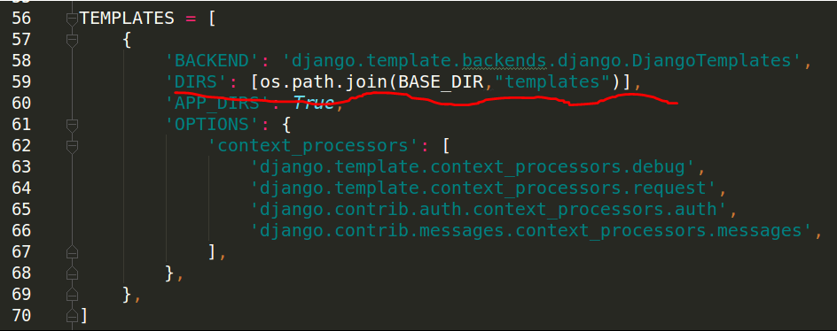

####定义视图
视图是python函数，定义在应用的views.py中
基本格式是
``` python
def func(request):
	pass
	return HttpResponse
```
第一个参数必须是HttpRequest类型的对象request，包含了所有请求信息
返回值必须是HttpResponse对象，包含了给请求者的响应信息
需要导入HttpResponse模块
``` python
from django.http import HttpResponse
```

####配置URLconf
需要进行两步操作
1.在应用文件下添加urls.py，在里面添加匹配方式
``` python
from django.conf.urls import url
# 导入视图模块 以调用视图
from APP.views import *
# 固定写法
urlpatterns = [
    # 表示如果匹配成功 调用func函数
    url(r"^index/$", func)
]
```
2.在项目的urls.py中添加新的查找途径
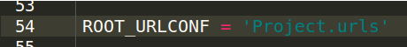
获取用户请求的路径后，先到Project.urls中进行匹配
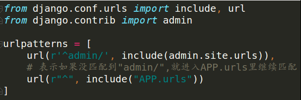
没匹配的"admin/"就进入1创建的urls.py里继续匹配
通过这种方式可以调用不同的视图

####将视图，模板，URL关联起来
- **定义指定功能的视图**
``` python
from django.shortcuts import render
# 必须要添加的模块
from django.http import HttpResponse
# 导入模型类 以调用模型类
from APP.models import HomeInfo,MemberInfo
# Create your views here.
def homeShow(request):
    # 使用ORM框架获取数据库数据
    # 获取HomeInfo里所有的数据 以列表形式返回给home_list
    home_list = HomeInfo.objects.all()
    # 创建一个字典(json风格)来保存获取到的数据
    context = {
        "home_list": home_list
    }
    
    # render方法返回的是一个HttpResponse对象
    # 第一个参数为HttpRequest类型的对象request
    # 第二个参数为封装好的模板的路径（django方式表示的路径）
    # 第三个参数为传递给模板的json风格的数据
    return render(request, "APP/index.html", context)

def memberShow(request, homeId):
    # 通过外键获取对应数据
    # 函数第二个参数homeId通过APP下的urls.py获取到
    # get返回一个值
    home = HomeInfo.objects.get(id=homeId)
    # 获取home里的member数据
    # memberinfo_set是根据模型类名自动生成的
    member_list = home.memberinfo_set.all()
    
    # 或者
    # member_list = MemberInfo.filter(home_id=homeId)
    # filter以列表形式返回所有匹配到的数据
    # home_id是自动生成的外键
    
    context= {
        "member_list": member_list
    }
    return render(request, "APP/member.html", context)
```
- **封装指定功能的模板**
先对TEMPLATES路径进行设置，参考上面的步骤描述
给index.html封装
``` htmlbars
<!doctype html>
<html lang="en">
<head>
    <meta charset="UTF-8">
    <meta name="viewport"
          content="width=device-width, user-scalable=no, initial-scale=1.0, maximum-scale=1.0, minimum-scale=1.0">
    <meta http-equiv="X-UA-Compatible" content="ie=edge">
    <title>Document</title>
</head>
<body>
    <ul>
        
            <!--"{{home.id}}/"表示相对路径"/index/xx/"-->
            <!--"/{{home.id}}/"表示从端口开始的路径"/xx/"-->
            <li><a href="{{home.id}}/">{{home.name}}</a></li>
        
    </ul>
</body>
</html>
```
给member.html封装
``` htmlbars
<!doctype html>
<html lang="en">
<head>
    <meta charset="UTF-8">
    <meta name="viewport"
          content="width=device-width, user-scalable=no, initial-scale=1.0, maximum-scale=1.0, minimum-scale=1.0">
    <meta http-equiv="X-UA-Compatible" content="ie=edge">
    <title>Document</title>
</head>
<body>
    <ul>
        
            <li>{{member.name}}</li>
        
    </ul>
</body>
</html>
```
- **对URL进行设置（具体步骤参考上面的描述）**
项目下的urls.py 添加
``` python
from django.conf.urls import include, url
from django.contrib import admin

urlpatterns = [
    url(r'^admin/', include(admin.site.urls)),
    # 表示如果没匹配到"admin/",就进入APP.urls里继续匹配
    url(r"^", include("APP.urls"))
]
```
应用下新建urls.py
``` python
from django.conf.urls import url
# 导入视图模块 以调用视图
from APP.views import *
# 固定写法
urlpatterns = [
    # 表示如果匹配成功 调用func函数
    url(r"^index/$", homeShow),
    # 匹配成功会把"\d+"作为第二个参数传递给memberShow函数，然后进行调用
    url(r"^index/(\d+)/$", memberShow)
]
```
