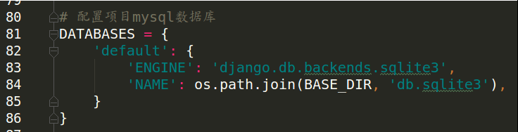
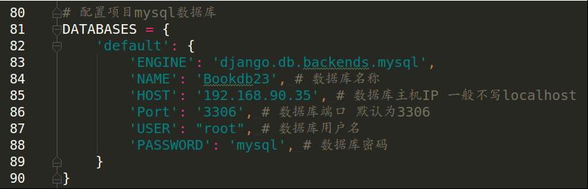
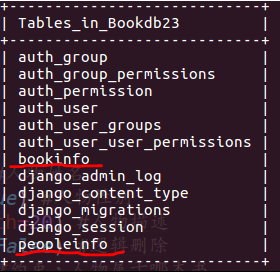

# MySQL数据库配置


安装pymysql包
进入虚拟环境
```
pip install pymysql
```
在项目的\__init__.py中添加pymysql包配置
``` python
import pymysql
pymysql.install_as_MySQLdb()
```

#### 配置mysql数据库
默认状态 Django项目默认采用sqlite3数据库 web项目首选是mysql数据库
<br>



修改后
<br>




#### 创建项目数据库
进入数据库 
```
mysql -uroot -pmysql
```
项目创建数据库 例 
``` sql
create database Bookdb23 charset=utf8;
```
数据库的表通过迁移创建

#### 模型迁移
先定义模型类
``` python
from django.db import models

# Create your models here.

# 书籍信息模型
class BookInfo(models.Model):
    name = models.CharField(max_length=20) #图书名称
    pub_date = models.DateField(null=True) #发布日期
    readcount = models.IntegerField(default=0) #阅读量
    commentcount = models.IntegerField(default=0) #评论量
    isDelete = models.BooleanField(default=False) #逻辑删除

    #元类信息 : 修改表名
    class Meta:
        db_table = 'bookinfo'
# 人物信息模型
class PeopleInfo(models.Model):
    name = models.CharField(max_length=20) #人物姓名
    gender = models.BooleanField(default=True) #人物性别
    description = models.CharField(max_length=20) #人物描述
    isDelete = models.BooleanField(default=False) #逻辑删除
    book = models.ForeignKey(BookInfo) # 外键约束，人物属于哪本书

    # 元类信息 : 修改表名
    class Meta:
        db_table = 'peopleinfo'
```
执行
```
python manage.py makemigrations
python maahe.py migrate
```


配置信息在migrations文件中生成


