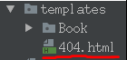

# Views-错误视图

Django内置处理HTTP错误的视图，主要错误及视图包括
- 404错误：page not found视图
	- url匹配不成功会发生404错误
- 400错误：bad request视图
	- 来自客户端的安全方面非法操作会引发400错误
- 500错误：server error视图
	- 在视图中代码运行报错会发生500错误
	- 如果utl配置格式写错误也有可能发生500（例STATICFIELS_URLS=[ ] ,[]错写成{}）

错误视图模板一般放在templates文件夹下
<br>




如果想看到错误视图而不是调试信息，需要修改settings.py文件的DEBUG项
``` python
# 注意点 一旦项目是线上模式 Django不再提供静态文件的处理 因为Django擅长处理动态逻辑，静态逻辑交给nginx服务器处理
DEBUG = True # 调试阶段 开发模式
# DEBUG = False # 线上模式
ALLOWED_HOSTS = [] # 调试模式不用写
# ALLOWED_HOSTS = ["*"] # 允许任何域名访问
```
