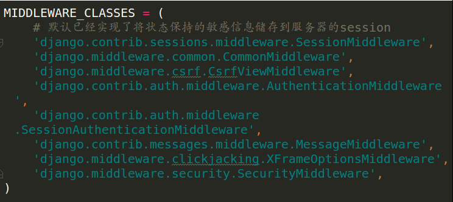
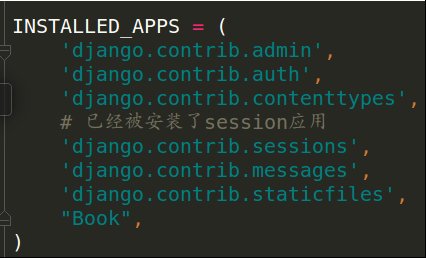

# 状态保持Cookie及Session

浏览器请求服务器是无状态的。

无状态：指一次用户请求时，浏览器、服务器无法知道之前这个用户做过什么，每次请求都是一次新的请求。

无状态原因：浏览器与服务器是使用Socket套接字进行通信的，服务器将请求结果返回给浏览器之后，会关闭当前的Socket连接，而且服务器也会在处理页面完毕之后销毁页面对象。

有时需要保持下来用户浏览的状态，比如用户是否登录过，浏览过哪些商品等

实现状态保持主要有两种方式：
- 在客户端存储信息使用Cookie
- 在服务器端存储信息使用Session
	- 关于Session的使用会在Redis数据库中介绍，因为Session数据是存储在Redis数据库中


### Cookie
Cookie是由服务器端生成，发送给客户端浏览器，浏览器会将Cookie的key/value保存，下次请求同一网站时就发送该Cookie给服务器（前提是浏览器设置为启用cookie）。

Cookie的key/value可以由服务器端自己定义。

#### 应用：
最典型的应用是判定注册用户是否已经登录网站，用户可能会得到提示，是否在下一次进入此网站时保留用户信息以便简化登录手续，这些都是Cookie的功用。

网站的广告推送，经常遇到访问某个网站时，会弹出小窗口，展示我们曾经在购物网站上看过的商品信息。

购物车，用户可能会在一段时间内在同一家网站的不同页面中选择不同的商品，这些信息都会写入Cookie，以便在最后付款时提取信息。

#### 提示：
Cookie是存储在浏览器中的一段纯文本信息，建议不要存储敏感信息如密码，因为电脑上的浏览器可能被其它人使用

Cookie基于域名安全，不同域名的Cookie是不能互相访问的
- 如访问itcast.cn时向浏览器中写了Cookie信息，使用同一浏览器访问baidu.com时，无法访问到itcast.cn写的Cookie信息

当浏览器请求某网站时，会将本网站下所有Cookie信息提交给服务器，所以在request中可以读取Cookie信息

### Cookie的使用
设置Cookie 在服务器中设置然后返回给浏览器，所以是response
``` python
response.set_cookie('mark','hello')
```
读取Cookie 读取requset中的cookie
``` python
c = request.COOKIES['mark']
```
判断是否存在某个Cookie
``` python
if request.COOKIES.has_key('mark'):
      # do something
```
	
删除Cookie
``` python
response.delete_cookie('mark')
```
	
### Session
对于敏感、重要的信息，建议要存储在服务器端，不能存储在浏览器中，如用户名、余额、等级、验证码等信息

在服务器端进行状态保持的方案就是Session

**Session依赖于Cookie**

####启用Session
Django项目默认启用Session

禁用Session：将Session中间件注释即可
<br>




#### Session存储方式
Session数据，可以存储在数据库、缓存、Redis等
- 设置SESSION_ENGINE项指定Session存储方式

存储在数据库中，如下设置可以写，也可以不写，这是默认存储方式
``` python
SESSION_ENGINE = 'django.contrib.sessions.backends.db'
```
存储在缓存中：存储在本机内存中，如果丢失则不能找回，比数据库的方式读写更快
``` python
SESSION_ENGINE = 'django.contrib.sessions.backends.cache'
```
混合存储：优先从本机内存中存取，如果没有则从数据库中存取
``` python
SESSION_ENGINE = 'django.contrib.sessions.backends.cached_db'
```
如果存储在数据库中，需要在项INSTALLED_APPS中安装Session应用
<br>



#### 默认存储Session的数据库
迁移后会在数据库中创建出存储Session的表

表结构
- 由表结构可知，操作Session包括三个数据：键，值，过期时间
- 默认过期时间是14天


### 常见Session操作
 通过HttpRequest对象的Session属性进行会话的读写操作，以键值对的格式操作Session
 
设置Session---把状态保持的信息写入到django_session表中，再把该数据生成一个cookie信息，写入到浏览器中   在django_session表中是以base64编码后的键和值进行储存
``` python
request.session['键'] = 值
```
读取Session
``` python
request.session.get('键',默认值)
```
删除指定键的值，在存储中只删除某个键对应的值
``` python
del request.session['键']
```
清除所有键的值，在存储中删除所有键对应的值
``` python
request.session.clear()
```
清除Session数据，在存储中删除所有键及对应的值，形成空表
``` python
request.session.flush()
```
设置会话的超时时间
``` python
request.session.set_expiry(value)
```
如果value是一个整数，会话将在value秒没有活动后过期

如果value为0，那么用户会话的Cookie将在用户的浏览器关闭时过期

如果value为None，那么会话则两个星期后过期


#### Session依赖于Cookie
在使用Session后，会在Cookie中存储一个键为sessionid，值为编码后的session的键的数据，每次请求时浏览器都会将这个数据发给服务器，服务器在接收到sessionid后，会根据这个值找出这个请求者的Session
