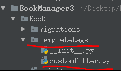

# 模板语言

#### 变量
- 变量作用：计算并输出上下文传入的数据
- 变量语法：
	- {{ 变量 }}
- 变量名规则：由字母、数字、下划线和点组成
	- 变量名不能以下划线开头
- 变量解析规则：当模版引擎遇到点如book.name，会按照下列顺序解析：
	- 1.字典book['name']
	- 2.先属性后方法，将book当作对象，查找属性name，如果没有再查找方法name()
	- 3.如果是格式为book.0则解析为列表book[0]
- 如果变量不存在则插入空字符串 ''
- 在模板中调用方法时不能传递参数
	- 如果要使用带参数的方法，需要使用过滤器


例
``` python
def variable(request):
    """演示变量读取"""
    user = {"age":"18"}
    context = {
        "name": "zxc",
        "user": user
    }
    # 渲染模板
    return render(request,"Book/variable.html", context)
```
-------------------------------
``` html
<body>
    <h1>{{name}}</h1>
    {#先把user当字典，age当key取值#}
    {#没有再把user当对象，age当属性取值#}
    {#没有再把user当列表，age当下标取值#}
    <h1>{{user.age}}</h1>
</body>
```

#### 标签
- 标签语法：

**常用标签**
- for循环标签

执行循环逻辑
{{ forloop.counter }}获取当前是第几次循环，从1开始

列表为空或不存在时执行此逻辑

- if标签

逻辑1

逻辑2

逻辑3

- 比较运算符标签
- 注意：运算符左右两侧不能紧挨变量或常量
- 运算符左右两侧必须有空格
``` html
 ==
 !=
 <
 >
 <=
 >=
```
- 布尔运算符标签
  and
  or
  not


例
``` python
def tags(request):
    """标签"""

    book_list = BookInfo.objects.all()

    context={
        "book_list" : book_list,
    }

    return render(request,"Book/tags.html", context)
```
-----------------------
``` html
<body>
    <ul>
        

            
	            <li style="background: red">{{ book.name }}</li>
            
	            <li style="background: green">{{ book.name }}</li>
            
	            <li style="background: blue">{{ book.name }}</li>
            

        
    </ul>
</body>
```
#### 过滤器
- 过滤器作用：模板语言中不允许带参数的函数，如果要对变量进行处理，就需要使用过滤器
- 使用管道符号 | 来应用过滤器，用于进行计算、转换操作，可以使用在变量、标签中
- 过滤器语法：
  一个参数时：变量|过滤器
  两个参数时：变量|过滤器:参数
- 过滤器语法说明：
	- 第一个参数就是变量
	- 如果过滤器需要追加参数，则使用冒号 : 传递参数
	- 冒号后面最多可以传一个参数

**常用过滤器**
- length，返回字符串、列表、元组、字典的元素个数
	- 变量|length
- default，如果变量不存在时则返回默认值
	- 变量|default:默认值
- date，用于对日期类型的值进行字符串格式化
	- 常用的格式化如下
		- Y表示年，格式为4位，y表示两位的年
		- m表示月，格式为01,02,12等
		- j表示日，格式为1,2等
		- H表示时，24进制，h表示12进制的时
		- i表示分，为0-59
		- s表示秒，为0-59
		- 日期|date:'Y年m月j日 H时i分s秒'


例
``` python
def filters(request):
    """过滤器"""
    book_list = BookInfo.objects.all()

    context = {
        "book_list": book_list,
    }

    return render(request, "Book/filter.html", context)
```
-----------------------
``` html
    <ul>
        
            
			{#使用过滤器达到相同效果#}
            {##}
                <li style="background: red">{{ book.name }}--{{book.pub_date|date:"Y年m月j日"}}</li>
				{#使用过滤器修改日期显示格式#}
            
            <li style="background: green">{{ book.name }}--{{book.pub_date}}</li>
            

        
    </ul>
```

**自定义过滤器**
- 当内建过滤器无法满足需求时，需要自定义过滤器
- 过滤器就是python中的函数，注册后就可以在模板中当作过滤器使用

例
``` python
def customFilter(request):
    """自定义过滤器"""
    book_list = BookInfo.objects.all()

    context = {
        "book_list": book_list,
    }

    return render(request, "Book/customfilter.html", context)
```
------------------
在根目录下创建python包(Python Package)名为templatetags(必须为此名)
- 在新建的templatetags包中新建一个py文件用来实现自定义过滤器的功能



- 自定义过滤器函数
``` python
	from django.template import Library
	
	# 注册对象：注册过滤器的  对象的名字必须为register
	register = Library()
	
	# 装饰器的作用是让mod函数不直接接收参数
	@register.filter
	def mod(num):
	    """奇偶数"""
	    return num%2 # 取模
	
	@register.filter
	def mod2(num1,num2):
	    """奇偶数  外界传入任意两个数字"""
	    return num1%num2 # 取模
```
--------------------------
``` html
<body>
    
    <ul>
	    
	        
	        {##}
	            <li style="background: red">{{ book.name }}--{{book.pub_date|date:"Y年m月j日"}}</li>
	        
	            <li style="background: green">{{ book.name }}--{{book.pub_date|date:"Y年m月j日"}}</li>
	        
	    
    </ul>
</body>
```
- 注意点
	- 1.自定义过滤器的python包，必须命名为templatetags
	- 2.创建注册对象，必须命名为register
	- 3.过滤器的第一个参数就是变量，当有第二个参数时，后面需要使用冒号，最多只能传二个参数


#### 注释
- 在模板中使用模板注释，注释掉某一段代码，那么这段代码不会被编译，不会输出到客户端；
	- html注释只能注释html内容，不能注释模板语言
- 单行注释语法如下
	- {#...#}
- 多行注释使用comment标签，语法如下
	- 
		...
		
- 注释可以包含任何模版代码，有效的或者无效的都可以注释掉
