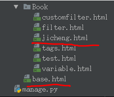

# 模板继承

#### 父模板
- 如果发现一段代码在多个模板中出现，那就应该把这段代码内容定义到父模板中
- 父模板中也可以使用上下文中传递过来的数据
- 父模板定义在templates文件目录下
- block标签：用于在父模板中预留区域，留给子模板填充差异性的内容
	- 可以给预留区域定义名字，但多个预留区域名字不能相同
	- 为了更好的可读性，建议给endblock标签写上名字，这个名字与对应的block标签名字相同

预留区域，可以编写默认内容，也可以没有默认内容

#### 子模板
- 子模板定义在templates/应用文件目录下
- extends标签：继承，写在子模板文件的第一行
{#继承父模板#}



- 子模版不用填充父模版中的所有预留区域，如果子模版没有填充，则使用父模版定义的默认值
- 填充父模板中指定名称的预留区域

实际填充内容
{{ block.super }} 用于获取父模板中block的内容，也可以不获取



例



``` python
def jicheng(request):
    """模板继承"""
    context = {
        "name": "zxc"
    }
    return render(request,"Book/jicheng,html", context)
```
-----------------------
``` html
<body>

这是父模板拿到的{{name}}
    
    


    
    <h1>我是父模板搜索框</h1>
    

    <h1>这是网站的头部</h1>
    <h1>这是网站的尾部</h1>
</body>
```
-------------------------
``` html
<body>
    {# 继承父模板 #}
    

    {# 一旦子模板继承了父模板，子模板自己的内容失效，子模板的内容必须写在父模板的标签当中 #}
    
    <h1 style="background: red">aasdsad{{name}}</h1>
    

    
    
</body>
```


- 注意点
	- 1.父模板定义在templates文件目录下
	- 2.子模板定义在templates/应用文件目录下
	- 3.子模版继承父模板之后，本身原有的内容是不起作用的
	- 4.父模板不能把上下文传给子模板，只继承内容不继承上下文
