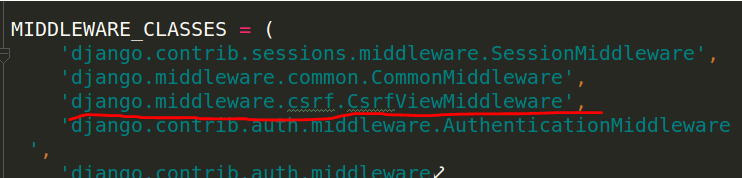

# CSRF机制

- CSRF全拼为Cross Site Request Forgery，译为跨站请求伪造。
- CSRF指攻击者盗用了你的身份，以你的名义发送恶意请求。
	- 包括：以你名义发送邮件，发消息，盗取你的账号，甚至于购买商品，虚拟货币转账......
- 造成的问题：个人隐私泄露以及财产安全。

- 黑客攻击攻击网站的一种方式
	- 先了解普通用户访问网页的过程：
		- 用户浏览器发送加载页面的请求
	服务器通过正则匹配成功并接受请求
	进行逻辑处理
		- 响应返回编写的html模板，如index.html
	- 黑客访问网页的过程：
		- 黑客客户端发送页面请求
		- 服务器进行正则匹配成功并接受请求
		- 进行逻辑处理
		- 响应返回黑客编写的html模板,如hack_index.html，修改html,css,js
	
- 防止这种问题的发生并保护用户的财产及信息
- 首先要使用post方式提交发起请求
	- 如果使用get方式进行请求，请求信息会显示在路径？后面，很容易泄露
	- 因此需要通过表单提交的方式进行数据的传输，method="post"
	
- 使用表单提交依然会产生隐患
	- 浏览器发出页面请求，服务器接受请求进行模板渲染，在响应给浏览器的时候，黑客将其拦截，返回的是黑客自己渲染后的页面，会对表单的action属性进行修改
	- 使浏览器获得的响应页面是黑客服务器发送出的
	- 如果用户输入隐私数据，服务器会将相关逻辑处理返回到黑客指定的目标或地址，造成用户的损失。

- 通过CSRF安全验证的方式可以有效方式此类问题的发生
Django默认开启CSRF安全验证功能



在模板中添加csrf_token
``` html
    <form action="/transfer/" method="post">
        {#向模板中嵌套安全验证的token#}
        {#下次再访问服务器时，就可以带着token#}
        
        {#生成input标签，写入name和value,响应一个cookie给浏览器，cookie的value和input的name一样#}
        <input type="text" name="name">
        <input type="text" name="pwd">
        <input type="submit" value="提交">
    </form>
```
csrf_token会在服务器第一次响应时向页面中添加一个input标签

如：
``` html
<input type='hidden' name='csrfmiddlewaretoken' value='EPqXapPxXUoe3nnXsCpoLzWaoV44rEbk' />
```
- 标签中的name和value就是用来进行安全验证的
- csrf_token会在生成标签后向浏览器设置一个cookie，key为csrftoken,value为input标签的value
- 当浏览器下次访问服务器时（提交表单时），Django会通过cseftoken携带的value去找input标签，如果没找到对应标签(即csrfmiddlewaretoken)或者找到的input的value与原来的不一样，就会提交失败，Forbidden错误


#### 总结：Django 提供的 CSRF 防护机制
- 1.Django 第一次响应来自某个客户端的请求时，会在服务器端随机生成一个 token，把这个 token 放在 cookie 里。然后每次 POST 请求都会带上这个 token，这样就能避免被 CSRF 攻击。
- 2.在返回的 HTTP 响应的 cookie 里，django 会为你添加一个 csrftoken 字段，其值为一个自动生成的 token
- 3.在所有的 POST 表单时，必须包含一个 csrfmiddlewaretoken 字段 （只需要在模板里加一个 csrf_token标签， django 就会自动帮我们生成）
- 4.在处理 POST 请求之前，django 会验证这个请求的 cookie 里的 csrftoken 字段的值和提 交的表单里的 csrfmiddlewaretoken 字段的值是否一样。如果一样，则表明这是一个合法的请求，否则，这个请求可能是来自于别人的 csrf 攻击，返回 403 Forbidden.

